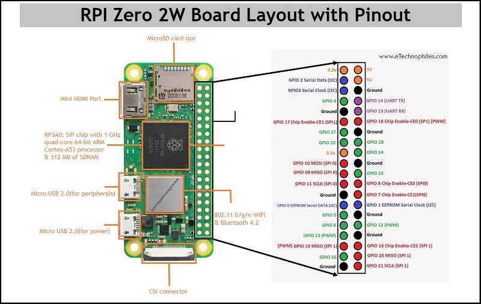
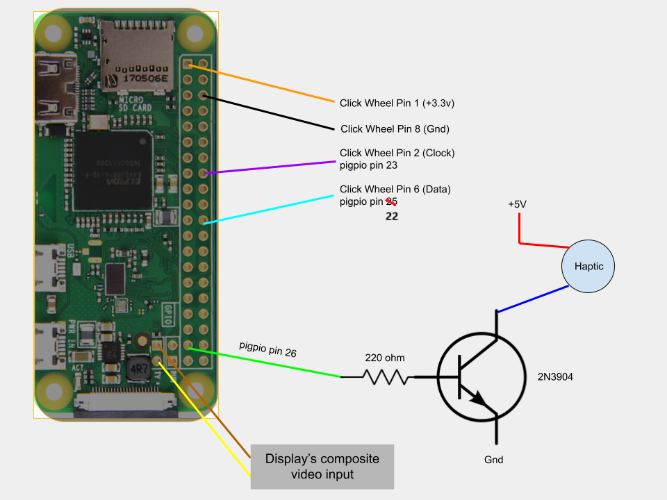
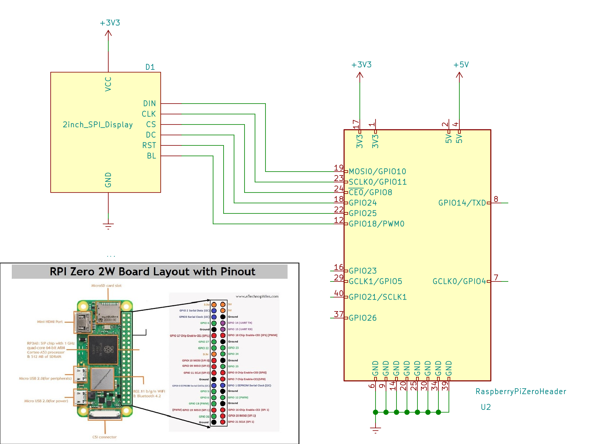

## Reminder to self: comment out framebuffer part of /boot/config.txt, this is only used for testing via vnc viewer
I'm using a ipod classic from 2004 (A1059)

# sPot
This is a Fork of the [Spotify Ipod](https://github.com/dupontgu/retro-ipod-spotify-client) by Guy Dupont

This code is meant to accompany my own version of [this project](https://hackaday.io/project/177034-spot-spotify-in-a-4th-gen-ipod-2004) in which a Spotify client is built into an iPod "Classic" from 2004. In my version everything is meant to run on a Raspberry Pi Zero 2 W. 

# Instructions
### I have used python 3.9.2 idk if itll work with other versions
### I used a Raspberry Pi zero 2 W. This guide uses the newest version of raspotify, which is not available to the older Rpi Zero models. You can still try with older versions of raspotify, but your mileage may vary.
\
Since we are using the lite version of raspbian, some extra packages need to be installed:
\
And if you need to configure wifi to enable ssh & vnc, you can edit `/etc/wpa_supplicant/wpa_supplicant.conf`
## Install updates 

```
sudo apt-get update 
sudo apt-get upgrade
```

## install prerequisites
```
sudo apt-get install midori

sudo apt-get install python-pip python-dev

sudo apt-get install python3-pip python-dev

sudo apt-get install realvnc-vnc-server


sudo apt install python-setuptools python3-setuptools

sudo apt install python3-pip

sudo apt-get install python3-tk 

sudo apt-get install python3-pil 
sudp apt-get install python3-pil.imagetk

sudo apt-get install redis-server

sudo apt-get install openbox

sudo apt install xorg

sudo apt-get install lightdm

sudo apt-get install x11-xserver-utils
```
then set redis-server to start on boot, which it does automatically but on some devices it don't: \
`sudo systemctl enable redis-server` \
& do this: \
`sudo service redis-server start` \
do the same for raspotify in later steps after it has been installed: \
`sudo systemctl enable raspotify`


# Clickwheel setup
NOTICE: the pins on the clickwheel ribbon cable should face down on the breakout board
The schematics for clickwheel wiring is at the bottom of the README

Install PiGPIO for clickwheel
```
wget https://github.com/joan2937/pigpio/archive/master.zip
unzip master.zip
cd pigpio-master
make
sudo make install
```
run 
```
gcc -Wall -pthread -o click click.c -lpigpio -lrt 
```
to compole click.c \
then run `sudo ./click &` so you can test the clickwheel (assuming the wiring is done)


# Display setup
I used a 2 inch model [waveshare ST7789V](https://www.amazon.de/Waveshare-Resolution-Interface-Examples-Raspberry/dp/B081Q79X2F) display
wiring for display also below.

I used [this guide](http://rsflightronics.com/spotifypod) which links to [this solution on github](https://github.com/dupontgu/retro-ipod-spotify-client/issues/23)

basically this is how to setup:\
Edit `/boot/config.txt` & comment `dtoverlay=vc4-kms-v3d` & add:
```
hdmi_group=2
hdmi_mode=87
hdmi_cvt=320 240 60 1 0 0 0
hdmi_force_hotplug=1
```
restart the pi, then
```
sudo apt install cmake git
cd ~
git clone https://github.com/juj/fbcp-ili9341.git
cd fbcp-ili9341
```
then edit `st7735r.h` & change `#define DISPLAY_NATIVE HEIGHT 240` to `#define DISPLAY_NATIVE HEIGHT 320` in line 20 
\
Then edit `st7735r.cpp` and comment out the line starting with `SPI_TRANSFER` (around line 100) then add `SPI_TRANSFER(0x37, 0, 0);` & save


then type
```
mkdir build
cd /build
```
Depending on what gpio pins you've soldered (refer to pinout below)  to `TFT_DATA_CONTROL` and `TFT_RESET_PIN` might be different.
for my case I used:
```
cmake -DST7789=ON -DGPIO_TFT_DATA_CONTROL=24 -DGPIO_TFT_RESET_PIN=25 -DSPI_BUS_CLOCK_DIVISOR=30 -DSTATISTICS=0 -DDISPLAY_BREAK_ASPECT_RATIO_WHEN_SCALING=ON -DUSE_DMA_TRANSFERS=OFF ..
```

in case you need to flip the screen, include this option before the two dots at the end:
```
-DDISPLAY_ROTATE_180_DEGREES=ON
```
afterwards run 
```
sudo make -j
```
\
you can now test the driver in that same folder with 
```
sudo ./fbcp-ili9341
```
\
but since the driver should start automatically on boot we have to do one last thing.
Open `/etc/rc.local` with a text editor with sudo privileges (e.g.):\
`sudo nano /etc/rc.local` if you don't know what you're doing, personally I prefer using vim

Add these lines before `exit` in the file:
```
# Start display driver
/home/pi/fbcp-ili9341/build/fbcp-ili9341 &
```

Now just save and close. Thats it, now the driver should be installed and run on boot.
### NOTICE: since we are using the default openbox desktop environment, the display might still be black.
To to test if its working, you can log onto your Pi using vnc, you should be able to right click to open certain apps. These actions should also be visible on the your display.

# Spotify API setup
TL:DR is
Create a Spotify [developer account](https://developer.spotify.com/dashboard/applications/), then create an app to get a client id and client secret, afterwars you can create your redirect URI

<details>
  <summary>Detailed API setup</summary>
  
  <li>got to https://developer.spotify.com/dashboard/applications/</li>
  <li>log in</li>
  <li>Create an app, the name and description can be whatever</li>
  <li>Enter `http://localhost:8080/` as the Redirect URI</li>
  <li>Select the Web API as the api to have access to</li>
  <li>Agree to all the terms nd whaterver and save</li>
  <li>Then go into the settings of the app to get the client ID and client secret. We will use these later</li>
  <br>
  <ul>
    <details>
      <summary>The steps above as pictures</summary>
      After loggin in you get to the dashboard. Here you want to create a new app
      
      Then you fill out all required fields as detailed above
      
      After creating the app you can now enter the settings and view the Client ID and Client Secret. These will be used later
      
    </details>
  </ul>

</details>

# Raspotify Setup
install raspotify
```sudo apt-get -y install curl && curl -sL https://dtcooper.github.io/raspotify/install.sh | sh```


edit the [raspotify](https://github.com/dtcooper/raspotify) configuration to your liking (all settings listed here: https://github.com/dtcooper/raspotify/wiki/Configuration).
\
The most importaint labels to fill out are `LIBRESPOT_USERNAME=""` and `LIBRESPOT_PASSWORD=""` these should be your spotify username/email and password.

\
Also enable the raspotify service to cover the odd case, where it doesn't enable automatically: \
```
sudo systemctl enable raspotify
sudo systemctl restart raspotify
```
\
other common values that might need changing are `LIBRESPOT_FORMAT=`, `LIBRESPOT_SAMPLE_RATE=`, `LIBRESPOT_DEVICE=` \ these 3 need to be configured, so that they work with your desired alsa audio output device (headphone jack for example)\
Devices can be checked by running `librespot --device ?` and fill out the 3 params accordingly to the output of this command


## Install python modules
run `pip install -r requirements` inside of `SpIpod/frontend/`
\
if you get an error while its installing Pillow e.g. 
```
The headers or library files could not be found for jpeg, a required dependency when compiling Pillow from source.
```
or something similair like for example:
```
ERROR: Failed building wheel for Pillow
```

try installing these: `sudo apt install libjpeg-dev zlib1g-dev` and attempt to install the python modules from above again


# [OLD] 
2. Install Required Packages.

Installation for python3-pip, raspotify, python3-tk, openbox
```

sudo apt install python-setuptools python3-setuptools

sudo apt install python3-pip

sudo curl -sL https://dtcooper.github.io/raspotify/install.sh | sh

sudo apt-get install python3-tk 

sudo apt-get install redis-server

sudo apt-get install openbox

sudo apt install xorg

sudo apt-get install lightdm

sudo apt-get install x11-xserver-utils

```


3. Install Dependencies

```
pip3 install -r requirements.txt
```

4. Install pi-btaudio
```
git clone https://github.com/bablokb/pi-btaudio.git
cd pi-btaudio
sudo tools/install
```
# Clickwheel setup
NOTICE: the pins on the clickwheel ribbon cable should face down on the breakout board\
5. Install PiGPIO for clickwheel
```
wget https://github.com/joan2937/pigpio/archive/master.zip
unzip master.zip
cd pigpio-master
make
sudo make install
```
run `gcc -Wall -pthread -o click click.c -lpigpio -lrt ` to compole click.c, then `sudo ./click &` to test

6. Setup Spotify API

First Create an App at https://developer.spotify.com/dashboard/applications/
```
https://accounts.spotify.com/authorize?client_id=XXXXXXXXXXXXXXXXXXXXXXXXXXXXX&response_type=code&redirect_uri=http%3A%2F%2F127.0.0.1&scope=user-read-playback-state%20user-modify-playback-state%20user-read-currently-playing%20	app-remote-control%20streaming%20playlist-modify-public%20playlist-modify-private%20playlist-read-private%20playlist-read-collaborative
```


7. raspi-config

` sudo raspi-config`

_Console Autologin_

_Display Option -> Screen Blanking -> Off_ if you want to avoid the screen turning black after a few seconds.


8. bash_profile

In *.bash_profile* added the following (if the file is not htere, you must create it)

```
#!/bin/bash

[[ -z $DISPLAY && $XDG_VTNR -eq 1 ]] && startx -- -nocursor

# Disable any form of screen saver / screen blanking / power management

xset s off

xset s noblank
```

9. Configure xinitrc

`sudo nano /etc/X11/xinit/xinitrc`


Inside, make sure the following is there:
```
#!/bin/sh

# /etc/X11/xinit/xinitrc

# global xinitrc file, used by all X sessions started by xinit (startx)

# invoke global X session script

#. /etc/X11/Xsession

exec openbox-session #-> This is the one that launches Openbox ;)
```
10. Run "spotifypod.py" with autostart

`sudo nano /etc/xdg/openbox/autostart`


and add the following command to launch spotifypod.py:

```
cd /home/pi/fork/retro-ipod-spotify-client/frontend/

sudo -H -u pi python3 spotifypod.py &

sudo /home/pi/fork/retro-ipod-spotify-client/clickwheel/click &
```

_Make sure that the paths are ok with your setup!!_

in ` sudo nano /etc/xdg/openbox/environment` all the variables needed to run spotifypod.py are set( SPOTIPY_CLIENT_ID, SPOTIPY_CLIENT_SECRET,SPOTIPY_REDIRECT_URI)

```
export SPOTIPY_CLIENT_ID='your_SPOTIPY_CLIENT_ID'

export SPOTIPY_CLIENT_SECRET='your_SPOTIPY_CLIENT_SECRET'

export SPOTIPY_REDIRECT_URI='your_SPOTIPY_REDIRECT_URI'
```

11. Synchronizing Spotify data!
Last but not least, if you want to make sure all your playlists artists, etc are synchronized every time you turn on your Spotypod, you can simply modify the script view_model.py with the following at line 16:

`#spotify_manager.refresh_devices()`

`spotify_manager.refresh_data()`


instead of calling refresh_device, you can execute refresh_data. This will sync all your data and then will eceute refresh.devices. This will make the boot up way slower! but it will synchronize every single time you switch on :). 
If you dont run at least once `refresh_data()` no playlist, artist or anything related with your account will be displayed!

12. Configure Raspotify

`sudo nano /etc/default/raspotify`


Uncomment and fill the following line:

`OPTIONS="--username <USERNAME> --password <PASSWORD>"`


And add whichever of the following options you want:

```
# The displayed device type in Spotify clients. 

# Can be "unknown", "computer", "tablet", "smartphone", "speaker", "tv",

# "avr" (Audio/Video Receiver), "stb" (Set-Top Box), and "audiodongle".

DEVICE_TYPE="smartphone"
```
then turn off discovery, so only devices logged into the same spotify account can interact with SpIpod (like for example managing queue)
```
LIBRESPOT_DISABLE_DISCOVERY=1
```

# Wiring

Here is the wiring of the hardware, as of revision 1. Note that the pin numbers correlate to those referenced in [click.c](./clickwheel/click.c)\

RPI Zero 2 W pinout

Clickwheel wiring

Display wiring

